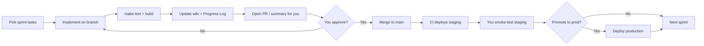

# Continuous Development & Deployment Pipeline

> **Status:** Approved — CI only; PaaS deploy later; one sprint per PR  
> **Last updated:** 2026-07-07

## Your approved setup

| Decision | Choice |
|----------|--------|
| Pipeline scope | **CI only** (tests + frontend build + Docker build) |
| Deploy target (later) | **PaaS** (Railway / Fly / Render) |
| Sprint model | **One sprint per PR** — you approve each merge |
| GitHub | **Not yet** — see [GitHub Setup](GitHub-Setup.md) |

---

## Goal

One repeatable loop from **Sprint 2 → Sprint 8** with:

1. Automated quality gates (tests, build, Docker)
2. Clear **approval checkpoints** (you say go before merge/deploy)
3. Agent continues the next sprint only after the previous is signed off

---

## Development loop (per sprint)

### Agent rules (after your approval)

| Step | Agent does | You do |
|------|------------|--------|
| Start sprint | Read sprint wiki, create branch `sprint/N-short-name` | — |
| Implement | Code + tests + wiki checkboxes | — |
| Gate | Run `make test`, `make build`, Docker build | — |
| Review | Post PR summary: what changed, how to test | **Approve PR** or request changes |
| Staging | Auto-deploy on merge (if CD enabled) | Quick smoke on staging URL |
| Production | Wait for explicit **“deploy prod”** from you | **Approve prod deploy** |
| Close sprint | Mark sprint complete in wiki | Confirm or reject |

**Hard stop:** Agent never merges or deploys to production without your explicit approval.

---

## CI pipeline (every push & PR)

GitHub Actions workflow `.github/workflows/ci.yml`:

| Job | Command | Purpose |
|-----|---------|---------|
| **backend-test** | `make test` | 27+ pytest cases, no LLM |
| **frontend-build** | `cd frontend && npm ci && npm run build` | Catch UI breaks |
| **docker-build** | `docker build .` | Production image builds |

Optional later:

- Lint (`ruff`, `eslint`)
- E2E with mocked LLM only (never real API key in CI)

---

## CD pipeline (deployment)

### Recommended: two environments

| Environment | Trigger | URL | Secrets |
|-------------|---------|-----|---------|
| **Staging** | Auto on merge to `main` | e.g. `staging.yourdomain.edu` or Fly/Railway preview | Staging API keys |
| **Production** | Manual approval (GitHub Environment) | e.g. `perspective-lab.yourdomain.edu` | Prod API keys |

### Option A — Docker on your server (matches current `docker-compose.yml`)

- CI builds image → push to **GitHub Container Registry** (`ghcr.io`)
- Staging server: `docker compose pull && docker compose up -d`
- Production: same, triggered only after you approve the `deploy-production` workflow

**Best if:** HAMK/university already has a Linux VM.

### Option B — Railway / Fly.io / Render

- Connect GitHub repo
- Auto-deploy `main` → staging
- Production = separate service + manual promote

**Best if:** no server admin, want fastest setup.

### Option C — CI only (no auto-deploy yet)

- Merge to `main` runs tests + Docker build only
- You deploy manually with `docker compose up` on laptop/server

**Best if:** you want pipeline first, hosting decision later.

---

## Secrets (GitHub → Settings → Secrets)

| Secret | Used for |
|--------|----------|
| `OPENROUTER_API_KEY` | Staging/prod runtime (not CI tests) |
| `EXPORT_API_KEY` | Production export auth |
| `DEPLOY_HOST` + `DEPLOY_SSH_KEY` | Option A SSH deploy (optional) |

CI tests **never** use real LLM keys (already enforced in pytest fixtures).

---

## Sprint execution order (unchanged)

| Sprint | Focus | Est. complexity |
|--------|-------|-----------------|
| 2 | LangGraph parallel | Medium |
| 3 | Theory-native outputs | Medium |
| 4 | Sequential pipeline | High |
| 5 | Sequential UI + HITL | High |
| 6 | GUI shell (shadcn) | High |
| 7 | Presentation & export | Medium |
| 8 | Tauri desktop | High |

After each sprint: PR → your approval → merge → (optional) staging deploy → you smoke-test → next sprint.

---

## What we implement first (after your OK)

1. **`.github/workflows/ci.yml`** — test + build + docker on every PR
2. **`.github/workflows/deploy-staging.yml`** — if you choose A or B
3. **`.github/workflows/deploy-production.yml`** — manual `workflow_dispatch` + environment protection
4. **`docs/wiki/Development-Pipeline.md`** (this file) + link from Home
5. **Start Sprint 2** on branch `sprint/2-langgraph`

---

## Approval checklist (sign off here)

- [x] **CI only first** — approved 2026-07-07
- [ ] **PaaS staging** — add after GitHub + CI green
- [x] **One sprint per PR** — approved
- [ ] **Git remote** — [GitHub Setup](GitHub-Setup.md)
- [ ] **Start Sprint 2** — after first push + CI green

---

[← Sprint plan](Sprints/README.md) · [Home](Home.md)
