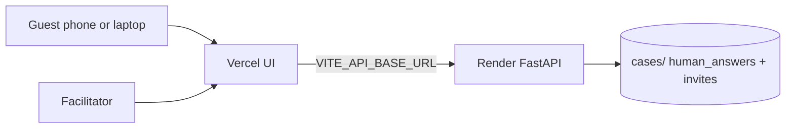

# Free cloud hosting (Vercel + Render)

PerspectiveLab is a **FastAPI + React** app. Vercel alone cannot run the Python API reliably.
Use this free split for remote invite links:

| Piece | Free host | Role |
|-------|-----------|------|
| Frontend | [Vercel](https://vercel.com) | Static UI (`frontend/dist`) |
| Backend | [Render](https://render.com) free Web Service | FastAPI + case files + invites |

**Short checklist:** see [CLOUD_DEPLOY.md](../../CLOUD_DEPLOY.md) (Render first → Vercel → link CORS).

Same-origin Docker on one paid/free VM is simpler long-term; this split is the easiest **free** path.

---

## Architecture



1. Facilitator asks agents → **Compare** → **Create invite link**
2. Guest opens `/invite/{token}` on Vercel (or Render if serving UI too)
3. Guest submits name / role / org / email / answer
4. Answer is **appended** under the same session and appears in Compare

---

## 1. Deploy backend (Render)

1. Push this repo to GitHub
2. Render → **New Web Service** → connect repo
3. Settings:
   - **Runtime:** Docker (uses repo `Dockerfile`) **or** Python
   - **Start command** (Python): `cd backend && gunicorn main:app -k uvicorn.workers.UvicornWorker -b 0.0.0.0:$PORT`
4. Environment variables:

```
ENVIRONMENT=production
CASE_ID=sao-paulo-dropout
OPENROUTER_API_KEY=...
EXPORT_API_KEY=...long-random...
CORS_ORIGINS=https://YOUR-APP.vercel.app
PUBLIC_APP_URL=https://YOUR-APP.vercel.app
ALLOWED_HOSTS=YOUR-SERVICE.onrender.com,YOUR-APP.vercel.app
```

5. **Persistence:** attach a persistent disk and mount so `cases/` survives restarts  
   (without a disk, invite answers are lost on redeploy).

Health check: `GET /api/health`

---

## 2. Deploy frontend (Vercel)

1. Vercel → Import repo → **Root Directory = `frontend`**
2. Build uses `frontend/vercel.json` (`npm run build` → `dist`)
3. Environment:

```
VITE_API_BASE_URL=https://YOUR-SERVICE.onrender.com
```

4. Deploy → open the Vercel URL.
5. Update Render `CORS_ORIGINS` + `PUBLIC_APP_URL` to that Vercel URL, then redeploy Render.

Full click-by-click: [CLOUD_DEPLOY.md](../../CLOUD_DEPLOY.md).

---

## 3. Local same-machine (no Vercel)

Invite links work on localhost too:

```
http://localhost:8000/invite/{token}
```

After `make desktop-dmg` / Start App, create a link on **Compare** and open it on another device **only if** that device can reach your Mac’s LAN IP (same Wi‑Fi). For people outside your network, use the cloud deploy above.

---

## Reliability checklist

- [x] Opaque invite tokens (not sequential IDs)
- [x] Expiry + max responses + close link
- [x] Append answers (no overwrite of other guests)
- [x] Rate limit on guest submit
- [ ] Persistent disk on Render for `cases/`
- [ ] Apple notarization (Mac DMG only — separate)
- [ ] Optional: auth for facilitators on public cloud
