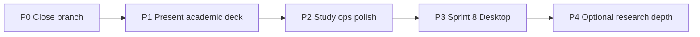

# Remaining work plan

**Date:** 2026-07-22  
**Context:** Sprints 1–7 + 9 are complete. Product is demo/pilot-ready (~7/10). This page sequences what is left.

---

## Goal reminder

PerspectiveLab answers: *Can people become better problem solvers with agentic AI across theoretical perspectives?*

Remaining work should either (A) **strengthen research use**, (B) **improve facilitation/presentation**, or (C) **ship the desktop app** — not random polish.

---

## Priority order (recommended)

| Priority | Theme | Outcome | Effort |
|----------|--------|---------|--------|
| **P0** | Ship current work | ✅ Done — [PR #6](https://github.com/sadiawaseem4487-create/perspective-lab/pull/6) merged 2026-07-22 | Small |
| **P1** | Academic Present structure | ✅ Done — Topic → Intro → Key concepts → Case → Conclusion + sources | Medium |
| **P2** | Study readiness | ✅ Done — Overview/rubric sync, Guide `/guide`, rubric CSV export | Small–medium |
| **P3** | Sprint 8 Desktop | Tauri 2, installers, API key wizard | Large |
| **P4** | Research depth (optional) | Causal protocol UI, stronger judge ops, multi-case packs | Large |

---

## P0 — Close the current branch

| Task | Done when |
|------|-----------|
| Commit remaining GUI + Present + dedupe + integrity work | ✅ |
| Open PR → CI green → merge | ✅ [PR #6](https://github.com/sadiawaseem4487-create/perspective-lab/pull/6) |
| Tag release notes (what changed for researchers) | ✅ Progress-Log + this page |

**Next:** P1 academic Present structure.

---

## P1 — Presentation aligned to academic outline

**Status:** ✅ Implemented (`sprint/10-presentation-academic`)

Your reference structure:

1. **TOPIC**
2. **INTRODUCTION**
3. **KEY CONCEPTS**
4. **CASE STUDY**
5. **CONCLUSION**
6. **Sources**

| Slide | Content |
|-------|---------|
| Topic | Case title + platform topic + session research question |
| Introduction | Why multi-theory agents; Live vs Demo honesty |
| Key concepts | Overview + one slide per theorist with key points |
| Case study | Context from `cases/{id}/presentation.json` + question |
| Synthesis | Four takeaways side by side |
| Conclusion | Discussion prompts |
| Sources | Curated links from case pack (infed.org, freire.org, HAMK Finna, …) |

### Tasks

| ID | Task | Status |
|----|------|--------|
| P1.1 | Extend `buildPresentationSlides` with academic kinds | [x] |
| P1.2 | Add `cases/{id}/presentation.json` + `GET /api/presentation` | [x] |
| P1.3 | Wire Present UI layouts + animations | [x] |
| P1.4 | EN/PT/FI strings | [x] |

**Exit:** Facilitator can run a full academic-style deck from one session without raw agent walls of text. ✅

---

## P2 — Study readiness (research ops)

**Status:** ✅ Implemented

| ID | Task | Status |
|----|------|--------|
| P2.1 | Update [Overview.md](Overview.md) capability matrix | [x] |
| P2.2 | Update [Problem-Solving-Rubric.md](Problem-Solving-Rubric.md) — API/UI live | [x] |
| P2.3 | Facilitator checklist — wiki + in-app **Guide** (`/guide`) | [x] |
| P2.4 | Export rubric + agreement CSV (`GET /api/export/rubric.csv`) | [x] |

**Exit:** A new researcher can run a pilot session using only the wiki + UI. ✅

**Next:** P3 Sprint 8 Desktop.

---

## P3 — Sprint 8 Desktop

See [Sprint-08-Desktop.md](Sprints/Sprint-08-Desktop.md).

| ID | Task |
|----|------|
| 8.1 | Tauri 2 shell wrapping Vite frontend |
| 8.2 | Bundle / proxy local FastAPI or document sidecar |
| 8.3 | First-run API key wizard (OpenRouter / OpenAI) |
| 8.4 | Mac `.dmg` + Windows installer CI |
| 8.5 | Smoke test: ask → report → present offline-capable install |

**Exit:** Non-developer can install and run a demo without terminal.

---

## P4 — Optional research depth (after P1–P3)

| ID | Task | Note |
|----|------|------|
| P4.1 | Study protocol wizard (baseline → agent → post) | Builds on rubric conditions |
| P4.2 | Auto LLM judge in CI sample set | Cost + flakiness controls |
| P4.3 | Second case pack (proves platform is generic) | No São Paulo hardcoding |
| P4.4 | Inter-rater dashboards / Cohen’s kappa | Beyond simple exact agreement |
| P4.5 | Repo rename `perspective-lab` | Cosmetic |

---

## Explicitly out of scope (unless you ask)

- Replacing the research tool with a Freire-only course website
- Claiming causal “better problem solvers” results without a coded study
- Force-push / rewriting published history

---

## Suggested next action

1. Commit/PR **P1 + P2** on `sprint/10-presentation-academic` (or split if preferred)  
2. Then start **P3** Desktop (`sprint/8-desktop`)  

[← Home](Home.md) · [Sprint plan](Sprints/README.md) · [Sprint 8](Sprints/Sprint-08-Desktop.md)
