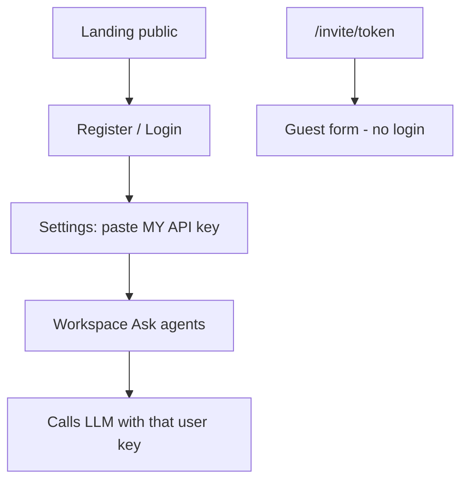

# User accounts & API keys

**Problem today:** One shared key in `backend/.env` — anyone who opens the app can spend that key.

**Goal:** Each person uses **their own** OpenRouter/OpenAI key. Your key stays for **you (admin)** only.

---

## Roles

| Role | Who | LLM key | Can do |
|------|-----|---------|--------|
| **Admin** | You | Server key in `.env` **or** personal key | Full app + manage seed admin |
| **User** | Lab colleagues / testers | **Must** paste their own key | Workspace → agents (billed to them) |
| **Guest** | Invite link respondents | None | Submit text only (no LLM) |

---

## Flow

1. User creates account (email + password)
2. Logs in
3. Saves **their** API key (stored per-user in SQLite, not in shared `.env`)
4. Ask agents → backend uses **that user’s key**
5. Guests on invite links never see or use any LLM key

---

## What we keep for you (admin)

- `ADMIN_EMAIL` / `ADMIN_PASSWORD` in `.env` (seeded on startup)
- Your existing `OPENROUTER_API_KEY` / `OPENAI_API_KEY` still work for the **admin** account
- Production can still set server keys for admin-only demos

---

## Out of scope for this MVP

- OAuth / Google login
- Email verification
- Billing / quotas UI
- Encrypting keys with a HSM (we use a local secret; good enough for lab)

---

## Files

- `backend/auth_service.py` — passwords, tokens, per-user keys
- `backend/database.py` — `users`, `auth_tokens`, `user_llm_keys`
- `POST /api/auth/register|login|logout`, `GET /api/auth/me`
- `GET/PUT /api/auth/llm-key` — user’s own key
- Frontend: Login / Register + protect AppShell
