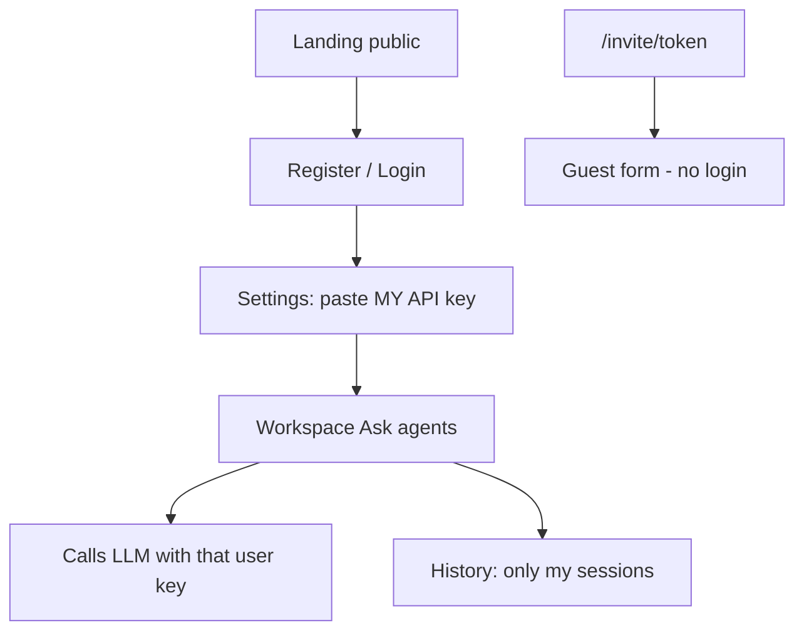

# User accounts & API keys

**Problem today:** One shared key in `backend/.env` — anyone who opens the app can spend that key.

**Goal:** Each person uses **their own** OpenRouter/OpenAI key. Your key stays for **you (admin)** only. Sessions and reports are private per account.

---

## Roles

| Role | Who | LLM key | Can do |
|------|-----|---------|--------|
| **Admin** | You | Server key in `.env` **or** personal key | Full app; sees **own** history only |
| **User** | Lab colleagues / testers | **Must** paste their own key | Workspace → agents (billed to them); own history |
| **Guest** | Invite link respondents | None | Submit text only (no LLM) |

---

## Flow

1. User creates account (email + password)
2. Logs in
3. Saves **their** API key (stored per-user in SQLite, not in shared `.env`)
4. Ask agents → backend uses **that user’s key** and tags the session with `user_id`
5. History / reports / compare only return that user’s sessions
6. Guests on invite links never see or use any LLM key

---

## Isolation rules

- `sessions.user_id` and `sequential_runs.user_id` scope ownership
- Report JSON includes `user_id`
- List/get/ask/report/compare/share APIs require login when `AUTH_REQUIRED=true` and filter by the authenticated user
- Public invite routes (`GET/POST /api/invites/{token}*`) stay open
- Legacy rows with `user_id = NULL` are hidden from logged-in SaaS users

---

## What we keep for you (admin)

- `ADMIN_EMAIL` / `ADMIN_PASSWORD` in `.env` (seeded on startup)
- Your existing `OPENROUTER_API_KEY` / `OPENAI_API_KEY` still work for the **admin** account
- Production can still set server keys for admin-only demos
- Admin does **not** see other users’ histories in this MVP

---

## Out of scope for this MVP

- OAuth / Google login
- Email verification
- Billing / quotas UI
- Admin cross-user audit UI
- Encrypting keys with a HSM (we use a local secret; good enough for lab)

---

## Persistence (Render)

Production must use **Postgres** via `DATABASE_URL` (wired in `render.yaml`).

- Local / tests: SQLite file (`DATABASE_PATH`) — fine
- Render without `DATABASE_URL`: ephemeral SQLite → accounts wiped every deploy (red login warning)
- Render with Postgres: `"persistent_storage": true` — create account once

See [ONLINE_DEPLOY.md](../../ONLINE_DEPLOY.md). Creating again with the same email + password signs you in.

---

## Files

- `backend/auth_service.py` — passwords, tokens, per-user keys
- `backend/database.py` — `users`, sessions/runs `user_id`, ownership helpers
- `POST /api/auth/register|login|logout`, `GET /api/auth/me`
- `GET/PUT /api/auth/llm-key` — user’s own key
- Frontend: Login / Register + History + protect AppShell
- **Sign out** always returns to `/login`; production builds never leave the workspace open anonymously
- Production (`ENVIRONMENT=production`) **always** requires login, even if `AUTH_REQUIRED=false`
